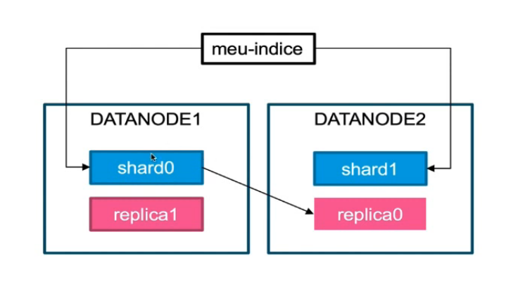

# Elastic Stack

## Componentes

### ELK Stack
E - ElasticSearch
	- Motor de procura e análise de texto e fonética por relevância
L - LogStash
	- Processador de dados através de pipelines que consegue recever, transformar e enviar dados simultaneamente, incluindo ao elasticsearch
K - Kibana
	- Visualizador gráfico de dados de elasticsearch.

#### ElastickSearch

- Motor de Busca
- Análise de Dados
- Banco de dados Orientado a Documentos
	- Tudo aquilo que é indexado é tranformado em documentos.
- Padão NoSQL
- Distribuido
	- pode haver vários nós
	- dados são procurados paralelamente
- Escalavel
	- Escalável a partir de nós
- Versão open source
- Schema Free
	- Não necessita de declarar tipo de dados para certos campos embora seja recomendado
- Conta com API Rest

#### Logstash
- Manipulação de Logs
- Coletor de dados em tempo real
- Recebe e envia dados de múltiplas fontes
- Conta com vários plugins que facilitam a filtragem.

#### Kibana
- Ferramenta de visualização e exploração de dados
- Usada com logs, análise de séries, Monitoramento de aplicações e inteligência operacional
- Integrado com ElasticSearch
- Agregadores e filtragem de dados
- Dashboards
- Gráficos interativos
- Mapas

## Diferença entre ELK Stack e Elastic Stack

A maior diferença entre estes componentes é o Beats, este agente é identica ao Logstash mas é executada a cada click.
	- lightweight data shipper
	- Agente Coletor de dados
	- Existem diversos tipos de Beats:
		- Auditbeat
		- Metricbeat
		- Filebeat
		- Packetbeat
		- Heartbeat
		- Winlogbeat
	- Facil integração com Elasticsearch ou Logstash
	- Possível construir um Beat

### Elastic Stack


# Elastic Search

## Instalação como serviço via apt

```sh
# Adicionar chave de registo
wget -qO - https://artifacts.elastic.co/GPG-KEY-elasticsearch | sudo apt-key add -

# Dependencias
sudo apt-get install apt-transport-https

# Definições de repositório
echo "deb https://artifacts.elastic.co/packages/7.x/apt stable main" | sudo tee /etc/apt/sources.list.d/elastic-7.x.list

# Instalação

sudo apt-get update && sudo apt-get install elasticsearch
```

## Configuração

### Localização de ficheiro de configuração
Os ficheiro de configuração estão em na diretoria /etc/elasticsearch quando instalados via apt. É possivel usar API de configuração de cluster.
Lista de ficheiro de configuração
- elasticsearch.yml
	- configuração de Elastisearch
- jvm.option
	- configuração de Java Runtime Enviroment
- log4j2.properties
	- configuração de login Elasticsearch
No caso de alterar a localização padrão dos ficheiros de configuração exportar ES_PATH_CONF com a localização do ficheiro.

### Formato da configuração

```yaml
path:
	data: /var/lib/elasticsearch
	logs: /var/log/elasticsearch
# OU
path.data: /var/lib/elasticsearch
path.logs: /var/log/elasticsearch

# usando lista de valores

discovery.seed_hosts:
	- 192.168.1.10:9300
	- 192.168.1.11
	- seeds.mydomain.com
# OU

discovery.seed_hosts: [192.168.1.10:9300, 192.168.1.11, seeds.mydomain.com]

# usando variaveis exportadas
export HOSTNAME="host1,host2"

node.name: ${HOSTNAME}
network.host: ${ES_NETWORK_HOST}


```

### Configurações importantes

#### PATH
Elasticsearch escreve os dados na diretoria 'data' e os logs na diretoria 'logs'.
Em ambiente de produção é recomendado atribuir 'path.data' e 'path.logs' fora de $ES_HOME
É possivel atribuir vários caminhos em path.data, 

#### Cluster
Um nó so se pode juntar a um cluster quando partilharem o mesmo c'luster.name', o nome predefenido é elasticsearch mas deve ser alterado para um nome que descreva o serviço.

```yaml
cluster.name: logging-prod
```

#### Node
Elasticsearch usa 'node.name' como um indentificador que possa ser lido por humanos. Este nome é incluido nas respostas da API e por padrão é o nome de hospedagem da máquina, este pode ser alterado.

```yaml
node.name: prod-data-2
```
###### Recomendações
	- Metade da memória RAM do servidor deve ser atribuida ao heap da JVM
	- Não deve ultrapassar 32GB de heap
	- Configuração minima e máxima de heap iguais, Xms igual a Xmx

###### Master Nodes
Nodes com atributo master podem ter estado eleito ou elegível, o node master eleito será aquele que retorna os dados e escrever o seu estado na variável cluster state, os restantes nodes elegivéis leem essa variável à espera de uma falha para assumirem o master eleito e servirem os dados em caso de problemas. O cluster state tem informação da saúde das shards e dos nodes de cada cluster. 


#### Network
Por predefinição elasticsearch atua no loopback da máquina, para alterar este comportamento deve ser alterado 'network.host'
```yaml
network.host
```
#### Discovery e definições de formação de cluster
Por predefinição elasticsearch está ligado ao loopback da máquina para analisar as portas locais de 9300 a 9305 para se conectar com outros nodes no mesmo servidor. Quando se quer formar um cluster com nodes em outros hosts é necessário configurar 'discovery.seed_hosts'.

```yaml
discovery.seed_hosts:
	- 192.168.1.10:9300
	- 192.168.1.11  *
	- seeds.mydomain.com **
```
* o numero da porta é opcional pois irá usar o padrão 9300.
** se o hostname for resolvido em multiplos IP's, o node vai tentar descobrir outros nodes em todos os endereços.

Quando o Elasticsearch é iniciado pela primeira vez, um processo de cluster bootstrapping determina o conjunto de master nodes que são incluidos. Este processo é automático em modo de desenvolvimento. Este processo é inerentemente inseguro e para isso deve-se atribuir uma lista de clusters iniciais.
```yaml
cluster.initial_master_node:
	- master-node-a
	- master-node-b
	- master-node-c
```
Os nodes devem ser identificados por 'node.name' que são predefenidos pelo seu hostname. No caso de ser um nome de dominio completamente qualificado(FQDN) como 'master-node-a.example.com' deve ser escrito na lista de 'cluster.initial_master_node'

#### Shards
Um indice pode contar com várias shards em diferentes nodes. Estas shards podem ser replicadas em uma shard em outro node.

##### Exemplos:

###### Indice, shard e datanode


```json
PUT dev-indice{
	"settings" : {
		"number_of_shards" : 2,
		"number_of_replicas" : 1
	}
}
```

#### Recomendações gerais

- ElasticSearch
	- Criar indices baseados em assuntos
	- Não tentar fazer do elastic uma base de dados relacional
- Node
	- Metade da memória para Heap. Xmx igual a Xms.
	- Ultrapassar 32Gb de Heap causa problemas de performance.
- Shard
	- Nunca ultrapassar 60Gb de dados por shard.

# Termos
- JVM heap size
	- Memória onde são guardados os dados de entrada antes de seres pedidos por um programa
	- diretamente relacionado com a memória fisica do sistema

- nodes
	- Instância servidora de elasticsearch
	- Apenas uma instância de elasticsearch por servidor

- cluster
	- conjunto de nodes com mesmo cluster.name
	- os nodes dentro de um cluster possuem diferentes funções
		- Master
			- Responsável pelas configurações e alterações de um cluster
		- Data
			- Responsável pelas operações a dados.
		- Ingest
			- Responsavel pelos pré-processamentos de dados

- index
	- Namespace que aponta para um ou mais shards

- shards
	- Instância única do lucene
	- Cada shard é um motor de busca completo de si mesmo
	- finito
	- os shards não são diretamente acessados pelo cliente, apenas pelo seu indice

- Apach lucene
	- Bíblioteca de software de mecanismo de pesquisa